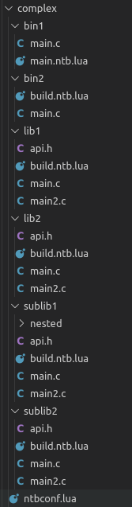

# NTB

A simple ninja file generator for Linux, with a focus on compiling and linking C/C++ applications.

Tested with Ninja 1.9.0. Untested on earlier versions.

## Building

On a Linux machine:

	$ cd /path/to/this/directory
	$ luajit build.lua

The build artefacts are placed in the `build` directory. The binary is at `build/bin/ntb`.

The binary is standalone and does not require lua to be installed on the system.

### Build Requirements

* Luajit 2.1.0-beta3 or higher.
* Luajit public headers and static library.
* GCC or Clang.

## Tests

Once NTB has been built following the instructions above, tests may be run as follows:

	$ lua /path/to/this/directory/test/main.lua

## Usage

NTB expects your projects to be laid out in a single folder with an `ntbconf.lua` file at the top level, like this:



Each project directory should have a Lua script file that ends in `.ntb.lua`, which contains the build instructions for that project.

The `ntbconf.lua` file at the top level must return a lua table with `targets` and `projects` values, like this example:

```lua
return {
	targets = {
		{
			name = "dbg";
			kind = "dbg";
		},
		{
			name = "rel";
			kind = "rel";
			cflags = {
				"-Ofast",
				"-march=native",
				"-mtune=native",
			};
		},
	};
	projects = {
		"bin1",
		"bin2/build.ntb.lua",
	};
};
```

The projects table consists of a list of paths to the build files for each project relative to the directory containing the `ntbconf.lua` file.

If a path doesn't end with `.lua`, then `/main.ntb.lua` is appended. So `bin1` will be treated as `bin1/main.ntb.lua`.

The `ntbconf.lua` file is just a normal Lua file so any kind of scripting can be performed, such as e.g. defining projects based on an environment variable:

```lua
local projects;
if os.getenv("FOOBAR") == "yes" then
	projects = {"a", "b"};
else
	projects = {"c", "d"};
end

return {
	targets = {
		{
			name = "dbg";
			kind = "dbg";
		},
		{
			name = "rel";
			kind = "rel";
			cflags = {
				"-Ofast",
				"-march=native",
				"-mtune=native",
			};
		},
	};
	projects = projects;
};
```

The project build files (e.g. the `bin1/main.ntb.lua` file mentioned above) look like this:

```lua
local lib2 = import("lib2");
local sublib2 = import("sublib2");

return cbinary(
	"bin1",
	{
		ccompile{
			"main.c",
		},
		lib2,
		sublib2,
	}
);
```

This build file imports two other projects called `lib2` and `sublib2` and returns a C binary called `bin1`. The `cbinary` function takes a name and a table of object files as the first and second parameter respectively.

Again, the build files are just normal Lua scripts so any kind of scripting can be performed.

NTB will, for each target specified in the `targets` array, execute each of the files referenced in the ntbconf.lua `projects` field in order. So looking at the `test/complex/ntbconf.lua` file as an example, NTB will execute `bin1/main.ntb.lua` and then `bin2/build.ntb.lua` for the `dbg` target, and then execute `bin1/main.ntb.lua` and then `bin2/build.ntb.lua` for the `rel` target.

To actually generate a Ninja file (or files) from your project, you'll need to run the following command:

	$ ntb /path/to/ntbconf.lua

This will generate an `_out` directory adjacent to the `ntbconf.lua` file, with subdirectories for each target. One Ninja file will be generated for each target. So if the `ntbconf.lua` file specifies a target with the name `foo`, then you'll have a Ninja file at `/_out/foo/build.ninja`. You can then run:

	$ ninja -f /path/to/_out/foo/build.ninja

NB: The `test` directory contains several sample projects.

## Reference

This section lists the Lua functions and variables provided by NTB that may be used in the `ntbconf.lua` file or any of the individual build files.

### Global variables

* `ntb.scriptDir`. The absolute path to the directory containing the current lua file.
* `ntb.scriptPath`. The absolute path of the currently-executing lua file.
* `ntb.projectsDirectory`. The absolute path to the directory containing the `ntbconf.lua` file.
* `ntb.buildDirectory`. The absolute path to the directory where the build artefacts (binaries, object files, etc.) of the current target will be placed.
* `ntb.target`. The currently-active target.

### Functions

* `import(filepath)`. Opens and executes the file at the supplied path. The path is assumed to be relative to the directory from which the `import` is called. If the filepath doesn't end with `.lua`, then `/build.ntb.lua` is automatically appended.

[TODO: finish documenting available functions.]

### Other

The `penlight` and `luafilesystem` modules are built in and may be used globally (e.g. `dir.getfiles(...)` or `lfs.currentdir()`).

## Why did you create this?

I needed a fast, lightweight, simple, and hackable build generator for an internal project. I had tried GNU Make, CMake, Premake, writing Ninja files by hand, among others, but nothing fit the bill. Hence NTB was born.